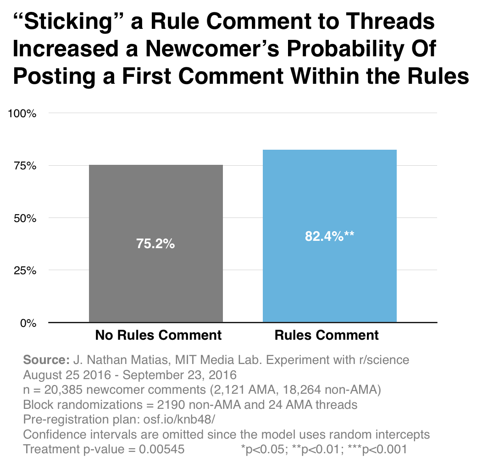
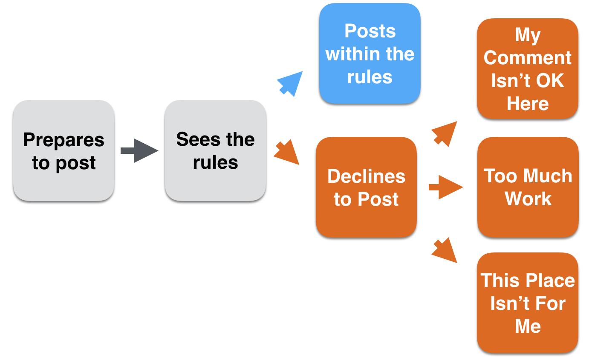
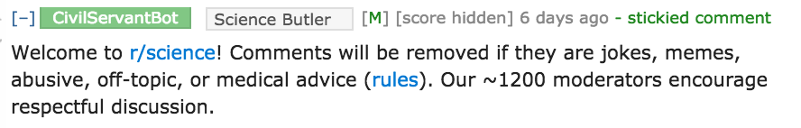
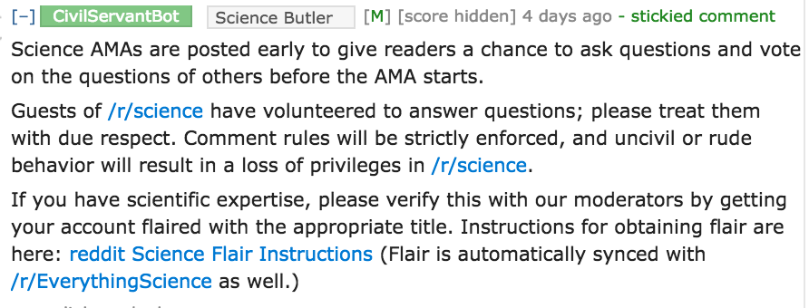
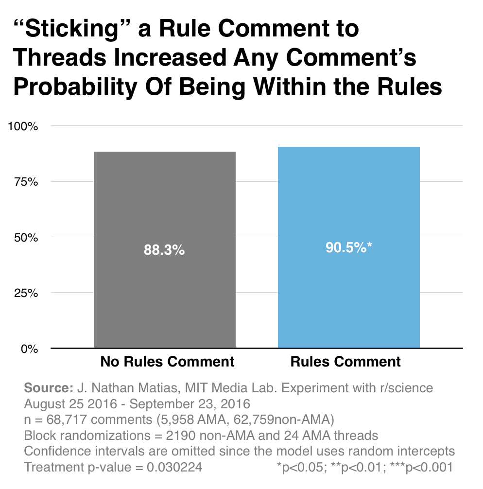

```{r analysis, include=FALSE, cache=TRUE, cache.extra=file.info('../r_science_sticky_experiment_results_09.28.2016.RData')}
knitr::opts_chunk$set(echo=TRUE)
load('../r_science_sticky_experiment_results_09.28.2016.RData')
library(texreg)
library(ggplot2)
library(pscl)
library(lubridate)
library(stargazer)
library(pscl)
library(lme4)
library(lmerTest)
```

Subreddit communities often develop extensive rules governing the kinds of participation they allow. But does making those policies visible have any effect on the rule-compliance of newcomers to the community? And might there also be a side effect on the number of people who participate? Over `r as.integer(difftime(max(exs.posts$datetime), min(exs.posts$datetime), unit="days"))` days in September, I worked with the moderators of r/science to test this question with a field experiment, an A/B test where we posted sticky comments to some threads and not to others.

**TLDR: Yes!** Adding a sticky comment with the rules has [a **positive `r signif(h1.effect*100., 2)` percentage point effect**](#h1_effect_on_newcomers) on the chance that a newcomer's comment will comply with the rules, on average across r/science, holding all else constant. Furthermore, [**posting the rules increases the incidence rate of newcomer comments by `r signif(h2.effect*100.,3)`%**](#h2_effect_on_newcomer_number) on average.

**But there's a catch!** In followup analyses, I found that [sticky comments had opposite effects in AMAs](#different_count_effects) (question-answer discussions with prominent scientists) compared to non-AMA posts. Posting the rules to a non-AMA thread caused a **`r signif(h2.interaction.nonama*100., 3)`% increase** in the incidence rate of newcomer comments, but in AMA threads, sticky comments caused a **`r signif(h2.interaction.ama*100.*-1,3)`% decrease** on average, the opposite outcome. Sticky comments [also affected the amount of moderator work per post](#overall_work). Posting a sticky comment increased the incidence rate of all comment removals by `r signif(h2.all.rm.nonama*100., 3)`% in non-AMA posts and decreased the incidence rate by `r signif(h2.all.rm.ama*100.*-1, 3)`% in AMA posts on average across r/science.

<center><div style="width:450px;">

</div></center>

*This experiment was a collaboration between J. Nathan Matias and the moderators of r/science as part of my PhD research at the MIT Media Lab & Center for Civic Media. A full description of the experiment procedures is at [osf.io/knb48/](http://osf.io/knb48/).*


## What Would Theories from Social Science Predict?
Theories from social psychology expect that sticky comments affect social norms, people’s beliefs about what others consider acceptable. In particular, posting rules constitute what Robert Cialdini would call injunctive norms, rules that ”specify what ought to be done... these norms enjoin it through the promise of social sanctions”— the threat of comment deletion [6]. Theories of social norms guide our first hypothesis, that posting the rules is likely to increase the chance that comments from newcomers will comply with the rules-- e.g. they won't get removed by moderators. Elsewhere, experiments in applied social psychology have found similar effects of posting signs on littering behavior [1, 2], smoking in hotel rooms [3], environmental conservation by hotel guests [4], and crime reporting [5]. So we had good reason to think that this might work.

But this effect on individual newcomers might have side effects. Theories on group identity and from computer science disagree on the possibility that posting the rules may also reduce participation in the community overall. 

In one view, people who see the rules might choose not to participate at all. Perhaps seeing the rules might convince newcomers that their comment isn’t acceptable in the community, so they might not comment at all. Posted rules increase the complexity of the task of commenting, requiring newcomers to tailor their comment to the community. Since people are less likely to complete tasks that are more complex, we expect that fewer newcomers will comment when the rules are visible [7]. Furthermore, newcomers encounter rules during their “investigation phase” with a community. After seeing the rules, a newcomer might decide that they don’t fit and may never participate [8].

On the other hand, if newcomers see that a community has policies they like and believe that it is well-moderated, they might be more likely to participate, as one lab study of news comments found [11].

<center><div style="width:450px; margin-top:20px; margin-bottom:20px;">

</div></center>

## How We Tested The Effect of Sticky Comments
To test the effect of sticky comments, I wrote a bot, /u/CivilServantBot, that continuously monitors all comments in the subreddit, including the actions of moderators. The full experiment design is at [osf.io/jhkcf/](https://osf.io/jhkcf/); here is a brief summary. During the experiment, this bot randomly assigned sticky comments within the group of non-AMA posts and also within the group of AMA posts. Partway through, we tweaked the bot to wait for two minutes before commenting, so any posts removed by AutoModerator are not included. All replies to the sticky comments were automatically removed. 

Because any thread had an equal chance to receive a sticky comment, we are able to make a *causal inference* about the effect of the sticky comment on the outcomes we care about:

* whether a newcomer's comment was removed or not by moderators (newcomers are calculated as any user account that didn't comment anywhere in the sub in the last 6 months.
* the number of newcomer comments in a thread

We also monitored many other variables about a post, including the number of minutes that each post spent on the top page for the subreddit, as well as reddit as a whole.

Here is the sticky comment we posted to non-AMA threads:

<center><div style="width:450px; text-align:center;margin-top:20px;margin-bottom:20px;" >

</div></center>

This is the sticky comment we posted to AMA threads, a sticky comment that r/science was already using.

<center><div style="width:450px; text-align:center;margin-top:20px;margin-bottom:20px;">

</div></center>

We ran the experiment for 2210 non-AMA posts and 24 AMA posts, and then stopped. Looking back, I found two bot software glitches in two different posts and pulled out the two blocks of 10 observations that they were in, leaving a total of `r nrow(exs.posts) ` posts in the analysis. The final analysis includes `r nrow(newcomer.comments)` newcomer comments, which were `r as.integer(nrow(newcomer.comments) / sum(exs.posts$num.comments)*100.)`% of all `r sum(exs.posts$num.comments)` comments during that period.

## Experiment Results
The full methods for describing the statistics are described in the pre-analysis plan for the experiment [osf.io/jhkcf/](https://osf.io/jhkcf/). Here are the model results.

### Model Results: The Effect of Sticky Comments on Newcomers ###   {#h1_effect_on_newcomers}
I tested the effect of sticky comments on newcomers by using a logistic regression model (**Model 5**). The details of the model are reported below the table. Notice that the number of threads is 883 in this model. Since this model looks at individual newcomer comments, it will not include threads where no newcomers posted. Statisticians will notice that I used a random intercepts model on the thread ID to account for the fact that we were assigning comments to threads rather than individual commenters.

```{r, echo=TRUE, results='asis'}
ccv1 <- glmer(visible ~ 1 + (1 | link_id), data = newcomer.comments, family = binomial, nAGQ=2)
ccv2 <- glmer(visible ~ post.visible + (1 | link_id), data = newcomer.comments, family = binomial, nAGQ=2)
ccv3 <- glmer(visible ~ post.visible + post.ama + (1 | link_id), data = newcomer.comments, family = binomial, nAGQ=2)
ccv4 <- glmer(visible ~ post.visible + post.ama + post.sub.top.minutes.ln + (1 | link_id), data = newcomer.comments, family = binomial, nAGQ=2)
ccv5 <- glmer(visible ~ post.visible + post.ama + post.sub.top.minutes.ln + post.treatment + (1 | link_id), data = newcomer.comments, family = binomial, nAGQ=2)

htmlreg(list(ccv1, ccv2, ccv3, ccv4, ccv5))
```

```{r echo=FALSE}
summary(ccv5)
```

### Model Results: The Effect of Sticky Comments on the Number of Newcomers ### {#h2_effect_on_newcomer_number}
I tested the effect of sticky comments on the number of newcomers by using a zero-inflated Poisson count model (**Model 3**). The zero-inflated model allows us to account for the large number of posts with zero newcomer comments. Out of all `r nrow(exs.posts)` posts, only `r nrow(subset(exs.posts, newcomer.comments>0))` had at least one newcomer comment. To slightly over-simplify, the zero-inflated model allows us to first predict posts with zeroes, and out of the remaining subset, predict the number of comments. Here is the final set of models. Since the model is trying to detect differences in the number of comments, I include many "regression adjustment covariates" to see what the effect is once we account for other differences. For example, some topics just get more attention than others; that's why the model includes a predictor for each individual flair category. You can see the experiment effect in the "TREAT" variable at the very bottom right. That is the number that I then convert to the final "incidence rate ratio." 

```{r, echo=TRUE, results='asis'}
zcm1 <- zeroinfl(newcomer.comments ~ 1 | visible + post.sub.top.minutes.ln, data=exs.posts, dist = "poisson")
zcm2 <- zeroinfl(newcomer.comments ~ visible + post.ama + post.flair + post.sub.top.minutes.ln + weekend + post.hour + I(post.hour^2) | visible + post.sub.top.minutes.ln, data=exs.posts, dist = "poisson")
zcm3 <- zeroinfl(newcomer.comments ~ visible + post.ama + post.flair + post.sub.top.minutes.ln + weekend + post.hour + I(post.hour^2) + TREAT | visible + post.sub.top.minutes.ln, data=exs.posts, dist = "poisson")
htmlreg(list(zcm1, zcm2, zcm3))
```
## Revisiting the Effect of Sticky Comments on the Number of Commenters ##  {#different_count_effects}

### Did All Threads Have The Same Effect?
When I chart the number of newcomer comments, we see something very odd; it looks like the effect might have been different for non-AMAs and AMA threads. Since I did block-randomization, it's possible to compare AMAs and non-AMAs.

<center>
```{r fig.width=7, fig.height=3, echo=FALSE}
ggplot(exs.posts, aes(post.ama, newcomer.comments, colour=factor(TREAT))) + 
  geom_violin() +
  geom_jitter(height=0.0) +
  theme(axis.text.x = element_text(hjust=0, vjust=1, size=14), 
        axis.title=element_text(size=14), 
        #plot.margin = unit(c(1.5, 1, 1, 1), "cm"), 
        plot.title = element_text(size = 14, colour = "black", vjust = -1)) +
  xlab("") +
  ylab("newcomer comments") +
  scale_colour_discrete(breaks = c(0, 1),
                        labels = c("No Sticky", "Sticky"), name="Experiment") +
  scale_x_discrete(breaks=c(FALSE, TRUE),
                   labels=c("Non-AMA", "AMA")) +
  ggtitle("Newcomer Comments Per Post (nonAMA = 2190) (AMA = 24)") 
```
</center>

I didn't anticipate this possibility at all, so it's not part of the pre-analysis plan. But if I add an interaction term to the model to tease out any differences(**Model 2**), I see that posting the rules to an AMA thread caused a **`r signif(h2.interaction.nonama*100., 3)`% increase ** in the incidence rate of newcomer comments, but **in AMA threads, sticky comments caused a **`r signif(h2.interaction.ama*100.*-1,3)`% decrease** on average, the opposite outcome. This table shows the two models next to each other:

```{r, echo=TRUE, results='asis'}
zcm4 <- zeroinfl(newcomer.comments ~ visible + post.ama + post.flair + post.sub.top.minutes.ln + weekend + post.hour + I(post.hour^2) + TREAT + post.ama:TREAT | visible + post.sub.top.minutes.ln, data=exs.posts, dist = "poisson")
htmlreg(list(zcm3, zcm4))
```
### Revisiting the Modeling Approach for Predicting The Number of Newcomer Comments
Another possible problem is that AMAs and non-AMAs might need to be modeled differently. AMAs never get zero comments, so the distribution of the dependent variable is very different for them. They are never removed by moderators, and they never happen on weekends, so some of the regression adjustment covariates don't apply in their case. Furthermore, there are only 24 AMAs in the sample, so they may get overpowered by all of the non-AMA threads in the final result. Those differences are very clear in the following log-transformed chart of newcomer comments per post:

<center>
```{r fig.width=7, fig.height=3, echo=FALSE}
ggplot(exs.posts, aes(post.ama, log1p(newcomer.comments), colour=factor(TREAT))) + 
  geom_violin() +
  geom_jitter(height=0.0) +
  theme(axis.text.x = element_text(hjust=0, vjust=1, size=14), 
        axis.title=element_text(size=14), 
        #plot.margin = unit(c(1.5, 1, 1, 1), "cm"), 
        plot.title = element_text(size = 14, colour = "black", vjust = -1)) +
  xlab("") +
  ylab("ln newcomer comments") +
  scale_colour_discrete(breaks = c(0, 1),
                        labels = c("No Sticky", "Sticky"), name="Experiment") +
  scale_x_discrete(breaks=c(FALSE, TRUE),
                   labels=c("Non-AMA", "AMA")) +
  ggtitle("ln Newcomer Comments Per Post (nonAMA = 2190) (AMA = 24)")
```
</center>

To confirm if posting the rules to AMAs had a negative effect on the number of newcomers, I fit a series of negative binomial model, removing covariates that just don't apply to AMAs. In this result (**Model 3**), I find that posting sticky comments to AMAs caused a `r signif(h2.nb*100*-1, 3)`% reduction in the number of newcomer coments, an estimate that is very close to the poisson model's result.

```{r, echo=TRUE, results='asis'}
nb1 <- glm.nb(newcomer.comments ~ 1, data=subset(exs.posts, post.ama==TRUE))
nb2 <- glm.nb(newcomer.comments ~ visible + post.sub.top.minutes.ln, data=subset(exs.posts, post.ama==TRUE))
nb3 <- glm.nb(newcomer.comments ~ visible + post.sub.top.minutes.ln +  TREAT, data=subset(exs.posts, post.ama==TRUE))
htmlreg(list(nb1, nb2, nb3))
```

### Why Might AMAs have the opposite effect from non-AMAs?
There are several reasons why we might see a negative effect in AMAs and a positive one elsewhere. Here are some possibilities:

1. ***The messages were different***. The non-AMA comment lists specific rules, explains the penalties of breaking them, and says how many moderators there are. The AMA comment (which was already in use) includes many other instructions, and it doesn't say how many moderators there are.
2. The AMA comment, unlike the non-AMA one, includes ***information for students and academics to get custom flair***. It's possible that this emphasis on expertise might convince some people that r/science isn't for them, and they never ask a question.
3. ***The AMA message is longer***. This week, the CTO of a large tech company told me that they have found that anything which pushes down content reduces participation: it's possible that the AMA message forces people to scroll more, making them less likely to comment.
4. ***Commenting on an AMA is different from a non-AMA thread***. Most ordinary threads have very few comments, so it's possible that the decision to comment requires newcomers to make a guess about what kind of replies they might get if they post one of the first comments. That's not true in AMAs, where many comments are expected. Furthermore, the kind of conversation is different. Perhaps because the standards are so high in a Q&A, it's possible that the sticky comment dissuades newcomers from posting off-topic questions. 
5. ***People Commenting on AMAs are different from non-AMA commenters***. Although I don't yet have evidence of this, I think this is highly likely. Some karma-seeking reddit users are attracted to AMA threads because comments in high-volume threads can collect more upvotes than more obscure discussions. Later, I plan to check to see if newcomers to AMA threads have been around reddit for longer than newcomers to non-AMA threads on average. It's possible that the sticky comment successfully dissuaded karma-seekers from participating in the first place. If so, then an effect that reduces the number of these newcomers might actually improve the quality of the conversation.


If subreddits are interested, further experiments could allow us to compare the performance of different kinds of messages.

## What Was The Effect Overall, Not Just Among Commenters?
The main hypotheses focused on the behavior of newcomers, but what was the overall outcome across all commenters? 

First, was there an effect on the rule-compliance across all commenters? Yes. Across r/science, the sticky comment had a positive `r signif(h1.all.effect*100, 3)` percentage point effect on the chance of any comment being accepted by moderators.

<center><div style="width:450px; text-align:center;">

</div></center>

```{r, echo=TRUE, results='asis'}
occv1 <- glmer(visible ~ 1 + (1 | link_id), data = exs.comments, family = binomial, nAGQ=2)
occv5 <- glmer(visible ~ post.visible + post.ama + post.sub.top.minutes.ln + post.treatment + (1 | link_id), data = exs.comments, family = binomial, nAGQ=2)
htmlreg(list(occv1, occv5))
```

Next, was there an effect on the number of commenters overall? In a zero-inflated poisson regression model, posting a sticky comment to a non-AMA threads increased the incidence rate of comments by `r signif(h2.all.nonama*100., 3)`%, while posting sticky comments to AMA threads reduced the incidence rate of comments by `r signif(h2.all.ama*100., 3)`%, on average across r/science..

```{r, echo=TRUE, results='asis'}
ozcm1 <- zeroinfl(num.comments ~ 1 | visible + post.sub.top.minutes.ln, data=exs.posts, dist = "poisson")
ozcm2 <- zeroinfl(num.comments ~ visible + post.ama + post.flair + post.sub.top.minutes.ln + weekend + post.hour + I(post.hour^2) | visible + post.sub.top.minutes.ln, data=exs.posts, dist = "poisson")
ozcm3 <- zeroinfl(num.comments ~ visible + post.ama + post.flair + post.sub.top.minutes.ln + weekend + post.hour + I(post.hour^2) + TREAT | visible + post.sub.top.minutes.ln, data=exs.posts, dist = "poisson")
ozcm4 <- zeroinfl(num.comments ~ visible + post.ama + post.flair + post.sub.top.minutes.ln + weekend + post.hour + I(post.hour^2) + TREAT + post.ama:TREAT | visible + post.sub.top.minutes.ln, data=exs.posts, dist = "poisson")
htmlreg(list(ozcm1, ozcm4))
```

## Do Sticky Comments Increase or Decrease Moderation Work Overall? ##      {#overall_work}
While the above models tell us things about the behavior of commenters, they don't give us a sense of whether the sticky comments increase or decrease the overall amount of moderation work. In a zero-inflated poisson regression model, posting a sticky comment increased the incidence rate of all comment removals by `r signif(h2.all.rm.nonama*100., 3)`% in non-AMA posts, and decreased the incidence rate by `r signif(h2.all.rm.ama*100.*-1, 3)`% in AMA posts on average across r/science. The model results are below. Note that this result includes all actions by the AutoModerator; I would need to recalculate the dependent variable to ask this question for human moderators.

<center>
```{r fig.width=7, fig.height=3, echo=FALSE}
ggplot(exs.posts, aes(post.ama, log1p(num.comments.removed), colour=factor(TREAT))) + 
  geom_violin() +
  geom_jitter(height=0.0) +
  theme(axis.text.x = element_text(hjust=0, vjust=1, size=14), 
        axis.title=element_text(size=14), 
        #plot.margin = unit(c(1.5, 1, 1, 1), "cm"), 
        plot.title = element_text(size = 14, colour = "black", vjust = -1)) +
  xlab("") +
  ylab("ln removed comments") +
  scale_colour_discrete(breaks = c(0, 1),
                        labels = c("No Sticky", "Sticky"), name="Experiment") +
  scale_x_discrete(breaks=c(FALSE, TRUE),
                   labels=c("Non-AMA", "AMA")) +
  ggtitle("ln Comments Removed Per Post (nonAMA = 2190) (AMA = 24)") 
```
</center>


```{r, echo=TRUE, results='asis'}
ocrm1 <- zeroinfl(num.comments.removed ~ 1 | visible + post.sub.top.minutes.ln, data=exs.posts, dist = "poisson")
ozcrm2 <- zeroinfl(num.comments.removed ~ visible + post.ama + post.flair + post.sub.top.minutes.ln + weekend + post.hour + I(post.hour^2) | visible + post.sub.top.minutes.ln, data=exs.posts, dist = "poisson")
ozcrm3 <- zeroinfl(num.comments.removed ~ visible + post.ama + post.flair + post.sub.top.minutes.ln + weekend + post.hour + I(post.hour^2) + TREAT | visible + post.sub.top.minutes.ln, data=exs.posts, dist = "poisson")
ozcrm4 <- zeroinfl(num.comments.removed ~ visible + post.ama + post.flair + post.sub.top.minutes.ln + weekend + post.hour + I(post.hour^2) + TREAT + post.ama:TREAT | visible + post.sub.top.minutes.ln, data=exs.posts, dist = "poisson")
htmlreg(list(ozcrm1, ozcrm4))
```

## Acknowledgments
Many people have made this experiment possible. Merry Mou wrote much of the CivilServant code along with me. Betsy Paluck and Donald Green offered feedback on the pre-analysis plan and modeling approach. Ethan Zuckerman, my advisor, has encouraged and supported this work throughout. Michael Bernstein suggested the second hypothesis on the number of commenters. r/science suggested the sticky comment experiment in the first place, and moderators also offered detailed feedback and suggestions on the experiment procedures throughout. Thanks everyone!

## References

[1] Susan M. Reiter and William Samuel. Littering as a Function of Prior Litter and The Presence or Absence of Prohibitive Signs. Journal of Applied Social Psychology, 10:45–55, 1980.

[2] Yvonne AW De Kort, L. Teddy McCalley, and Cees JH Midden. Persuasive trash cans: Activation of littering norms by design. Environment and Behavior, 2008.

[3] Harold H. Dawley, John Morrison, and Sudie Carrol. The Effect of Differently Worded No- Smoking Signs on Smoking Behavior. International Journal of the Addictions, 16(8):1467– 1471, January 1981.

[4] Noah J. Goldstein, Robert B. Cialdini, and Vladas Griskevicius. A Room with a Viewpoint: Using Social Norms to Motivate Environmental Conservation in Hotels. Journal of Consumer Research, 35(3):472–482, October 2008.

[5] Leonard Bickman and Susan K. Green. Situational Cues and Crime Reporting: Do Signs Make a Difference?1. Journal of Applied Social Psychology, 7:1–18, March 1977.

[6] Robert B. Cialdini, Carl A. Kallgren, and Raymond R. Reno. A focus theory of normative conduct: A theoretical refinement and reevaluation of the role of norms in human behavior. Advances in experimental social psychology, 24(20):1–243, 1991.

[7] Carsten Eickhoff and Arjen de Vries. How crowdsourcable is your task. In Proceedings of the workshop on crowdsourcing for search and data mining (CSDM) at the fourth ACM interna- tional conference on web search and data mining (WSDM), pages 11–14, 2011.

[8] John M. Levine, Richard L. Moreland, and Hoon-Seok Choi. Group socialization and new- comer innovation. Blackwell handbook of social psychology: Group processes, 3:86–106, 2001.

[9] Alan S. Gerber and Donald P. Green. Field experiments: Design, analysis, and interpretation. WW Norton, 2012.

[10] J. Scott Long. Regression models for categorical and limited dependent variables. Advanced Quantitative Techniques in the Social Sciences, 7, 1997.

[11] Wise, K., Hamman, B., & Thorson, K. (2006). Moderation, response rate, and message interactivity: Features of online communities and their effects on intent to participate. Journal of Computer‐Mediated Communication, 12(1), 24-41.