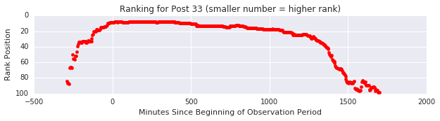
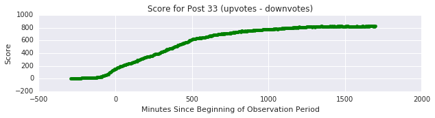
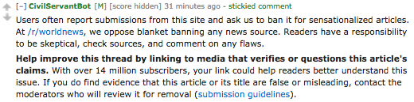
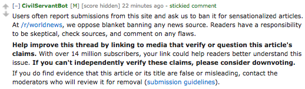
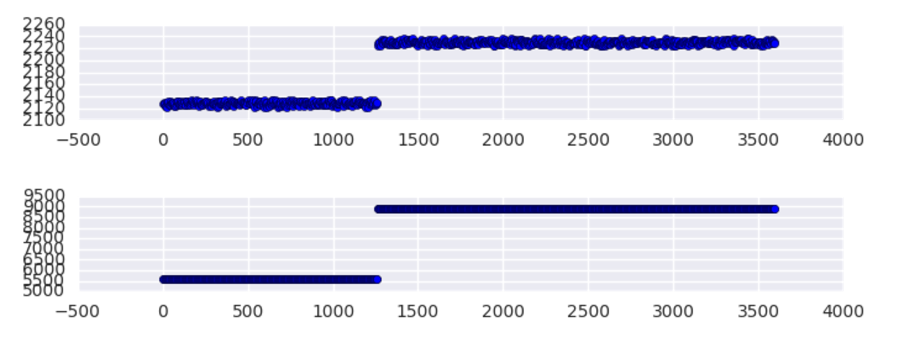

```{r analysis, include=FALSE, cache=TRUE, cache.extra=file.info('../r_worldnews_sticky_experiment_results_01.18.2017.RData')}
knitr::opts_chunk$set(echo=TRUE, warning=FALSE)
load('../r_worldnews_sticky_experiment_results_01.18.2017.RData')
library(ggplot2)
library(lubridate)
library(stargazer)
library(texreg)
library(gmodels) # Contains CrossTable
library(effects)
library(blockrand)
library(rms)
library(MASS)
library(pscl)
library(lme4)
```
Some online news sources regularly publish inaccurate, sensational articles that often receive disproportionate amounts of attention. When these articles are shared on social media platforms, they sometimes spread more quickly and widely than articles with more measured language and sourcing practices. Responses that work to verify claims or offer alternative views could reduce a perceived social consensus supporting the article [1] or even lead to changed beliefs [2]. Yet in online discussions, responding to unreliable articles could also have the effect of promoting those articles through algorithms that determine the relative prominence of information on a platform.

In this experiment with r/worldnews, a 14.8 million subscriber community on the reddit platform, we ask if using "sticky comments" encouraging norms of evidence-based discussion increases the chance that commenters will link to evidence. We also ask a second set of questions related to reddit's ranking systems with two "arms," two different kinds of sticky comments. In one arm of the experiment, we consider if encouraging skepticism causes reddit's algorithm promoting posts from unreliable websites. We expect the other arm to reduce a post's prominence in the site's rankings.

The research site is r/worldnews, a 14.8 million subscriber subreddit community on the social news platform reddit, where links to news are often shared and discussed. Measured in November 2016, this English language community received 914 posts per day on average, 2.4% of which are from tabloid news sites that community members tend to report for being more sensational and less reliably sourced. Of all of these tabloid posts, 46% are permitted by moderators. Among all tabloid posts 78% have at least one comment and 28% have at least one comment with a link. Across all comments in discussions of tabloid posts, 5% of comments include at least one link.

Moderators also report that tabloid posts are often among the most highly recommended in their subreddit by the reddit platform. Even small changes in the reception orprominence of these articles might have a substantial effect on the experience of the subreddit's many readers. On the reddit platform, readers are able to influence the prominence of discussions. They can add "upvotes" or "downvotes" to the thread to influence its relative prominence in the platform's ranking system. While reddit does not publicize the number of votes received by a discussion, software can regularly query the position of a post on the subreddit's front page or the site-wide listing of top discussions. Furthermore, the platform does provide information on the "score" of a post, a number partially-based on upvotes and downvotes which is used to determine rankings. In an email on Jan 16, 2017, a reddit employee confirmed to me that: "between two posts of similar age, the one with a higher score will tend to be ranked more highly in the HOT algorithm on average," especially for the default HOT listing on a subreddit.

## What Outcomes Would We Expect?
We expect that posting a message encouraging people to link to evidence will cause people to be more likely link to evidence in their comments. In a previous experiment with r/science, we found that [posting sticky comments with the subreddit rules caused newcomers to be more likely to follow subreddit rules](http://civilservant.io/moderation_experiment_r_science_rule_posting.html). So we expect that our sticky comments will have some effect on commenting behavior.

A recent study (not peer reviewed) found that adding a single upvote to a post early in its history could have very large effects on ultimate votes over time [4]. We can't be certain what expect from the reddit algorithm, since the score and HOT algorithms are not public knowledge (in an email on Jan 16, 2017, a reddit employee confirmed that they differ from the open source version of the reddit software). However we do have the ability to track the rank position and score of a submitted link over time, as shown in these early, exploratory charts from a prominent post:

<center><div style="width:450px; margin-top:20px; margin-bottom:20px;">

<br/>

</div></center>

We know that the algorithm pays attention to upvotes and downvotes, and many other things. We also know that the age of a post and its score are powerful predictors of the rank. Furthermore, the ranking of an individual item is relative to the score and age of other items in the list. I confirmed this in a statistical model of the page rank of `r length(unique(rankings$post.id))` posts between `r min(rankings$datetime)` and `r max(rankings$datetime)` based on snapshots of the top 100 items taken every 4 minutes.

```{r, echo=FALSE, results='asis'}
m1 <- lmer(rank ~ 1 + (1|post.id), data=rankings)
m2 <- lmer(rank ~ score + minutes.elapsed + I(minutes.elapsed^2) + (1|post.id), data=rankings)
m3 <- lmer(rank ~ score + minutes.elapsed + I(minutes.elapsed^2) + median.age + median.score + (1|post.id), data=rankings)

htmlreg(list(m1, m2, m3), caption="Factors predicting the rank of a submission on r/worldnews/. Lower rank numbers are higher in the listing", digits=5, custom.note="*** p < 0.001, ** p < 0.01, * p < 0.05")
```

In these results we see that among posts appearing in the top 100 of a given ranking at a moment in time, posts with higher scores receive higher rankings (0 is higher, 100 is lower), and that older posts are ranked lower. We also see that the ranking of a post is related to the median score and median age of the other items in the rankings. If the tendency of scores at a given time is lower, then a small positive difference in score will be associated with a larger difference in the rankings. To sum up, **we can expect that if our intervention affects the score of a post, it will also affect how the reddit HOT algorithm ranks that post**. 

## How We Tested The Effect of Our Sticky Comments
To test the effect of our sticky comments, I used the /u/CivilServantBot, which continuously monitors all posts and comments in the subreddit, including the actions of moderators. The full experiment design is at [osf.io/hmq5m/](https://osf.io/hmq5m/); here is a brief summary. During the experiment, this bot randomly assigned sticky comments to posts from domains that moderators identified, sites that met two criteria: (a) the subreddit receives large volumes of links from these sites, and (b) community members routinely complain about them for sensationalized headlines and unreliable information. The list does not include many US sites because r/worldnews disallows news from the US:

* dailymail.co.uk
* express.co.uk
* mirror.co.uk
* news.com.au
* nypost.com
* thesun.co.uk
* dailystar.co.uk
* metro.co.uk

With this experiment, we tried two different kinds of sticky comments. The first encouraged people to link to further evidence about the topic:

<center><div style="width:450px; text-align:center;margin-top:20px;margin-bottom:20px;" >

</div></center>

A second sticky comment encouraged people to link to further evidence and also downvote genuinely-unreliable articles:

<center><div style="width:450px; text-align:center;margin-top:20px;margin-bottom:20px;">

</div></center>

Within these domains, any post had an equal chance to receive (a) no sticky comment, (b) a the sticky comment encouraging links to evidence, or (c) the encouragement to downvote. 

### Outcome Variables
By comparing these three, we are able to make a *causal inference* about the effect of the sticky comment on the outcomes variables we care about:

* the chance of a comment to **include links to further evidence**

** Excluding bots, comments removed by moderators, links to other reddit pages, and links to image sites like giphy and quickmeme (we kept imgur, since its sometimes used for publishing photos of breaking news)

* We tried to monitor **the highest rank achieved by a post** in /r/worldnews/HOT, the default subreddit view

** Unfortunately, our code only collected the top 100 items, rather than the larger list we intended. So we are substituting for the **score of the post after 24 hours**. We sampled the post score every four minutes.

During the experiment, reddit made a [change to the scores they report on the site](https://www.reddit.com/r/announcements/comments/5gvd6b/scores_on_posts_are_about_to_start_going_up/). The site formerly held scores at a ceiling, but starting on December 6, the platform begain to report the ``true'' score for a post. Since we were observing the scores over time, we were able to see the change in score caculations when they occurred. Here is a chart showing the change in score for two very popular posts.

<center><div style="width:450px; text-align:center;margin-top:20px;margin-bottom:20px;">

</div></center>

In statistical tests of the effect of our experiment on the score of a post over time, I look at two values:

* the **score after 24 hours** <!--, analyze only the period after the algorithm change, which is what matters most to the community -->

* <!--when using the whole dataset of posts, model--> the **score after 9 days, 6 hours, 55 minutes**, which is the point at which scores for all posts in the experiment were calculated using the same method, and are thus comparable

In all but two posts, these two values are highly correlated (`r signif(cor(posts$snapshot.score, posts$later.score), 3)`), as you can see here in this plot comparing the two:

<font color="red">TODO: remove all entries that were polled more recently than 223 hours?</font>

<center>
```{r fig.width=7, fig.height=3, echo=FALSE}
ggplot(posts, aes(log1p(snapshot.score), log1p(later.score))) +
  geom_point() +
  theme(axis.text.x = element_text(hjust=0, vjust=1, size=10), 
        axis.title=element_text(size=14), 
        #plot.margin = unit(c(1.5, 1, 1, 1), "cm"), 
        plot.title = element_text(size = 14, colour = "black", vjust = -1)) +
  labs(x = "ln Score After 24 Hours",
     y = "ln Score After ~223 Hrs") +
  ggtitle("Most Scores Didn't Change After the reddit Algorithm Update, 12/06/2016")
```
</center>

### Other Variables
We also monitored many other variables about a post, including whether it was removed by moderators, the number of comments, the time a post was submitted, and whether the post was made on a weekend. We polled the score of the post every four minutes and took a snapshot of the HOT ranking every four minutes. This allowed us to generate a number for the median score and age of other items in the HOT ranking at the time.


## Experiment Results
We tested the effect of encouraging skepticism and downvotes across a total of **`r nrow(posts)`** posts from `r min(posts$datetime)` to `r max(posts$datetime)`. We initially specified to run the experiment for a total of 660 posts, but I was late to the analysis, which allowed CivilServant to collect more posts. The results are more precise for the larger dataset.

### The Effect of Sticky Comments on Fact-Checking Behavior
I tested the effect of sticky comments on fact-checking behavior in two ways. First, I estimate the chance of a comment to include at least one link. In this model, `r length(unique(tabloid.comments$link_id))` posts had at least one comment, roughly `r signif(length(unique(tabloid.comments$link_id)) / nrow(posts) * 100, 3)`% of all `r nrow(posts)` in the experiment. In the second model, I estimate the number of comments that include links in a discussion, across all `r nrow(posts)` posts in the experiment.

On average in discussions of tabloid submissions on r/worldnews, that encouraging skepticism had a positive effect on the chance that an individual comment would include at least one link:

```{r, echo=TRUE, results='asis'}
ec1 <- robcov(lrm(includes.links ~ post.visible , x=T, y=T,data=tabloid.comments), cluster=tabloid.comments$link_id)
ec2 <- robcov(lrm(includes.links ~ post.visible + treatment.a + treatment.b, x=T, y=T,data=tabloid.comments), cluster=tabloid.comments$link_id)

fp.a <- 1/(1+exp(-1*(ec2$coefficients['Intercept'] + ec2$coefficients['post.visible=True'] + ec2$coefficients['treatment.a'])))
fp.b <- 1/(1+exp(-1*(ec2$coefficients['Intercept'] + ec2$coefficients['post.visible=True'] + ec2$coefficients['treatment.b'])))
fp.0 <- 1/(1+exp(-1*(ec2$coefficients['Intercept'] + ec2$coefficients['post.visible=True'])))

htmlreg(list(ec1, ec2), caption="The effect of encouraging skepticism (treatment.a) and skepticism + downvoting (treatment.b) on the chance of a comment to include links", custom.note="*** p < 0.001, ** p < 0.01, * p < 0.05")
```

On average, comments under tabloid submissions with no sticky comment have a `r signif((fp.0)*100, 3)`% chance of including a link. Posting a sticky comment **encouraging skepticism caused a comment to be `r signif((fp.a - fp.0)*100, 3)` percentage points more likely to include at least one link**.  Posting a sticky comment **encouraging skepticism and discerning downvotes caused a comment to be `r signif((fp.b - fp.0)*100, 3)` percentage points more likely to include at least one link**. Both results are statistically significant.

As documented in the code, I use [the Huber-White method for clustering the standard errors](https://www.rdocumentation.org/packages/rms/versions/5.1-0/topics/robcov) associated with having multiple comments for some posts. I also confidmed that the results for a random-intercepts logistic regression model are similar.

**How important is this effect?** An increase in 1% might not seem much. However, working from the control group information, I estimate that over a similar `r as.integer((max(posts$datetime) - min(posts$datetime)), units = "days")` day period, the sticky comment could lead to `r signif( (nrow(subset(comments, post.treatment==0))*3) * fp.b, 3)` comments to include evidence that wouldn't have otherwise.

Even as we look at the effect on individual comments, we can also examine the effect on the number of evidence-bearing comments per post. This allows us to look at all `r nrow(posts)` posts, not just posts that received comments:

```{r, echo=TRUE, results='asis'}
nc <- glm.nb(comment.links.comments ~ 1, data=posts)
nc0 <- glm.nb(comment.links.comments ~ visible, data=posts)
nc1 <- glm.nb(comment.links.comments ~ visible + treatment.a + treatment.b , data=posts)
htmlreg(list(nc, nc0, nc1), caption="The effect of encouraging skepticism (treatment.a) and skepticism + downvoting (treatment.b) on the number of comments that include links.", custom.note="*** p < 0.001, ** p < 0.01, * p < 0.05")
```

Within discussions of tabloid submissions on r/worldnews, **encouraging skeptical links increases the incidence rate of link-bearing comments by `r signif(exp(nc1$coefficients['treatment.aTRUE'])*100, 3)`% on average**, and the sticky **encouraging skepticism and discerning downvotes increases the incidence rate by `r signif(exp(nc1$coefficients['treatment.bTRUE'])*100, 3)`% on average**.

Why would we see such differences in the effect size between the model of comments and the model of posts? The reason is that the sticky commments didn't just *change* the content of comments -- they also increased the number of comments. When fact-check and non-fact-check comments increase alongside each other, the chance of any individual comment to include links grows more slowly. My [experiment pre-analysis plan](http://osf.io/knb48/) focused on the chance of comments to include links. In retrospect, I should probably have focused on the number of evidence-bearing comments in the discussion thread. The negative binomial model in the third column above is a good fit, and it stands a Bonferroni test for [multiple comparisons](https://en.wikipedia.org/wiki/Multiple_comparisons_problem), so I'm confident in both results.

### The Effect of Sticky Comments on Reddit's Algorithms

<!--information about the dates and the numbers of observations. Mention what percentage of posts were covered by the experiment. Mention how many posts were removed by moderators and how many comments were removed by moderators.

--> 

## Questions About The Experiment Results

### Did The Experiment Influence Tabloid Submissions?
Throughout the experiment, submitted posts linking to these domains remained steady at a mean of `r signif(mean(posts.per.day$tabloid_pct)*100, 2)`% of all posts in the subreddit, even as the number of total submissions per day increased across the subreddit during the experiment.

<center>
```{r fig.width=7, fig.height=3, echo=FALSE}
ggplot(posts.per.day, aes(day, tabloid_pct, color=factor(after_experiment))) +
  geom_point() +
  ylim(0,1) +
  scale_colour_discrete(name="Period",labels=c("Before Experiment", "During Experiment")) +
  
  theme(axis.text.x = element_text(hjust=0, vjust=1, size=10), 
        axis.title=element_text(size=14), 
        #plot.margin = unit(c(1.5, 1, 1, 1), "cm"), 
        plot.title = element_text(size = 14, colour = "black", vjust = -1)) +
  labs(x = "ln Score After 24 Hours",
       y = "ln Score After ~223 Hrs") +
  ggtitle("Proportion of Tabloid Submissions to r/worldnews Over Time")
```
</center>   

### Did The Experiment Influence Moderation of Tabloid Submissions?
Moderators do appear to have adjusted their behavior towards the kinds of submissions we were observing, in the period just before we started the experiment. In this chart, you can see that in many cases, moderators allowed all tabloid submissions to remain, but that in the lead-up to the experiment start, when we were beta testing the software, they became more selective in what they permitted to remain.

<center>
```{r fig.width=7, fig.height=3, echo=FALSE}
ggplot(posts.per.day, aes(day, tabloid_kept, color=factor(after_experiment))) +
  geom_point() +
  scale_colour_discrete(name="Period",labels=c("Before Experiment", "During Experiment")) +
  
  theme(axis.text.x = element_text(hjust=0, vjust=1, size=10), 
        axis.title=element_text(size=14), 
        #plot.margin = unit(c(1.5, 1, 1, 1), "cm"), 
        plot.title = element_text(size = 14, colour = "black", vjust = -1)) +
  labs(x = "ln Score After 24 Hours",
       y = "ln Score After ~223 Hrs") +
  ggtitle("Proportion of Tabloid Submissions Permitted by Moderators Over Time")
```
</center> 

Comparing the acceptance rate before and during the experiment, we see that the acceptance rate was lower during the experiment period:

```{r, echo=TRUE, results='asis'}
its <- lm(tabloid_kept ~ after_experiment, data=posts.per.day)
htmlreg(list(its), caption="Modeling Proportion of Tabloid Posts Kept by Moderators",custom.note="*** p < 0.001, ** p < 0.01, * p < 0.05")
```

On average, after the start of the experiment, a tabloid submission had a `r signif(its$coefficients['after_experiment']*100, 3)`% smaller chance of being allowed to remain by moderators, a relationship that is statistically significant. 

However, I did not find an effect of the sticky comments on the chance of a link being allowed to remain. I expected that if people did more fact-checking, they might discover problems with links and alert moderators, resulting in the removal of unreliable links. This did not occur, perhaps because moderators were especially vigilant and consistent in their application of the rules. In the following model, we fail to find a causal relationship between the sticky notes and the chance of a post being allowed to remain by moderators.

```{r, echo=TRUE, results='asis'}
btvs1 <- glm(visible ~ factor(post.treatment), data = posts, family=binomial)
htmlreg(list(btvs1), caption="Modeling Post Visibility", custom.note="*** p < 0.001, ** p < 0.01, * p < 0.05")
```

### Who Did The Fact-Checking?

## Acknowledgments
Many people have made this experiment possible. Merry Mou wrote much of the CivilServant code along with me. r/worldnews suggested the unreliable news experiment in the first place. Thanks everyone!

## References

[1] Stephan Lewandowsky, Ullrich K. H. Ecker, Colleen M. Seifert, Norbert Schwarz, and John Cook. *Misinformation and Its Correction Continued Influence and Successful Debiasing.* Psychological Science in the Public Interest, 13(3):106-131, December 2012.

[2] Thomas Wood and Ethan Porter. *The Elusive Backfire Eect: Mass Attitudes' Steadfast Factual Adherence.* SSRN Scholarly Paper ID 2819073, Social Science Research Network,Rochester, NY, August 2016.

[3] Alan S. Gerber and Donald P. Green. *Field Experiments: Design, Analysis, and Interpretation.* WW Norton, 2012

[4] Glenski, M., & Weninger, T. (2016). Rating Effects on Social News Posts and Comments. arXiv preprint arXiv:1606.06140.