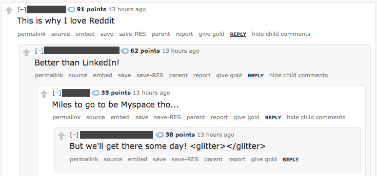

```{r analysis, include=FALSE, cache=TRUE, cache.extra=file.info('../stylesheet.experiment.results.RData')}
knitr::opts_chunk$set(echo=TRUE)
load('../stylesheet.experiment.results.RData')
library(texreg)
library(ggplot2)
library(pscl)
library(lubridate)
library(stargazer)
library(pscl)
library(rms)
library(texreg)
```

Do downvote buttons protect communities from unruly comments, cause conflict, or do they do both?

This fall, CivilServant worked with the 3-million subscriber politics discussion community on reddit to find an answer. Working on a short timeline and expecting the platform to change reddit's design any day, we assembled a quick study that we hoped would offer further evidence on the question, even if it wouldn't provide a conclusive answer. From July 31st through September 7th, we tested this idea by hiding the downvote button on randomly assigned days and looking for systematic differences. This post reports what we learned.




## Do Downvotes Protect Communities, Cause Conflict, or Both?
In theory, downvote buttons on comments offer powerful ways for online communities to manage unruly behavior, especially in large conversations that outpace the capacity of more formal moderation. Studying Slashdot behavior in the early 2000s, Cliff Lampe and Paul Resnick discovered that reader voting could be a reliable measure of comment quality (Lampe & Resnick 2004). 

Yet in the intervening years, many communities have become worried about the possible downsides to downvotes. In political discussions, people sometimes use downvotes to suppress views they disagree with, and the conflict over attention may cause more problems than downvotes solve. That's what Justin Cheng and Christian Danescu-Niculescu-Mizil discovered in an analysis of comment voting across four political news sites (Cheng, Danescu-Niculescu-Mizil, Leskovec 2014). In a quasi-experiment, they found that people who were downvoted commented more, said worse things, and downvoted other people on average– something that could potentially continue a spiral of conflict.

On reddit, many communities have attempted to reduce comment downvoting by modifying the visual style of their communities to hide the downvote button. Research by Lana Yarosh, Stuart Geiger, and Tom Wilson has identified [four major reasons that reddit communities hide downvotes](https://medium.com/@lanayarosh/down-with-downvotes-why-do-subreddits-disable-downvotes-efb298f06c88):

* They worry that downvotes would increase negativity
* They believe that downvotes drive conflict
* They think that downvotes are being used to bury certain views
* Small communities don't think they need downvotes

On the other hand, many people on reddit are in favor of downvotes:

* Some see downvotes as an essential tool for managing spam, inaccurate information, and off-topic comments
* Some deride hiding downvotes as an attempt to create "safe spaces" for discussion
* Some consider it against the spirit of reddit

In our [public consultation with the r/politics community this July](https://www.reddit.com/r/politics/comments/6o1ipb/research_on_the_effect_downvotes_have_on_user//), we heard many similar questions and concerns on both sides. Unlike the groups that Lana, Stuart, and Tom studied, we also heard from people who expected that hiding downvotes probably wouldn't have much effect, since only desktop users are affected.

## Testing the Effect of Reducing Downvotes
While Justin Cheng's research offered persuasive evidence of a possible effect from downvotes, it wasn't the kind of randomized trial that would offer a clearer picture of the effects. So when the moderators of r/politics reached out to CivilServant about improving civility in their community, we decided to test the effect of hiding downvotes.

r/politics is a 3 million subscriber reddit community where links to news are often shared and discussed. For comparison, in September 2016, the community had roughly 138,000 monthly commenters who made 1.8 million comments.

From July 31st through September 7th, we randomly assigned some days to have comment downvotes hidden and other days to keep them visible. While a study of that size is too small to detect small changes, we hoped that this prototype study would give us a chance to get an initial picture, and maybe observe any big changes if we were lucky.

While we cannot prevent all downvotes, we can in theory reduce the share of downvotes that a comment receives (we kept the downvote button for posts). When downvotes are hidden, they are only hidden from some users on the desktop version of the site. Mobile users and desktop users with special plugins can circumvent our change, and they account for around half of voters. While this study only looks at the effect of reducing downvotes rather than disabling downvotes entirely, it's more directly useful on reddit, where communities can only hide downvotes on the desktop.

## What Effects Do We Expect From Hiding Downvotes?

First, *we expected comments to receive a greater proportion of up-votes than downvotes on days where the down-vote button was hidden*. We measured this by looking at the comment score, a somewhat-obfuscated number provided by reddit that combines the upvotes and downvotes. Everything hinged on this: if our experiment had no effect on the votes that people received, than we couldn't expect the experiment to have much effect on their future behavior.

Next, we expected that when we hid downvotes, the subreddit would *receive more comments* and that *more comments would be removed* on average.

We also expected that *first-time commenters in the subreddit would come back and comment more* if their first comment happened on a downvote-able day. That's what Justin's findings expected.

<!-- Next, we expected that *first-time commenters would post in less civil ways over time* if their first comment happened on a downvote-able day. We measured this using LIWC, software that identifies "negative emotion words" associated with incivility and "Cognitive Mechanical" words associated with rational debate. -->

In our discussion with r/politics community members, we heard worries that days without downvotes would leave them defenseless against their political opponents, and that they would be flooded with bad-faith comments from another side. Yet other people wondered if bad-faith comments might be the product of good-faith commenters who experience systematic downvoting and who lose faith in the possibility of a respectful conversation. To study this question, we classified commenters' prior political participation in three ways:

* **Politically-commenting account**: 10% or more of their posts or comments in 2017 before July 31 were posted in any political subreddit other than r/politics [our list](https://docs.google.com/spreadsheets/d/e/2PACX-1vQMSxnq4r12fzPwiYd8DtKzdubaF1si52GFHjujDmIQGAnXYGTVJPIOClcNjbqVurZ5FjtjP9hlbHB4/pubhtml) was based on the r/politics [list of political subreddits](https://www.reddit.com/r/politics/wiki/relatedsubs). `r sprintf("%1.1f", nrow(subset(user.politics,pct.politics >0.1))/nrow(user.politics)*100)`% of r/politics in that period were classified this way.
* **Left-leaning account**: They are a politically-commenting account and 10% or more of their political posts/comments were in US left-leaning subreddits. 
* **Right-leaning account**: They are a politically-commenting account and 10% or more of their political posts/comments were in US right-leaning subreddits
* **The_Donald -leaning account**: They are a politically-commenting account and 10% of their political posts/comments were in [subreddits identified as related to The_Donald in algorithms by Trevor Martin](http://www.shorttails.io/interactive-map-of-reddit-and-subreddit-similarity-calculator/). These subreddits are 'conservative', 'asktrumpsupporters', 'hillaryforprison', 'uncensorednews', 'askthe_donald', 'libertarian', 'mr_trump', and 'conspiracy'.

We then combined these into measures of the number and percentage of politically-related comments made per day.

By the way, from January 1st through July 31st 2017, commenters on the left submitted `r prettyNum(sum(user.politics$left.observations), big.mark=",")` comments and posts. Commenters on the right made `r prettyNum(sum(user.politics$right.observations), big.mark=",")` contributions, out of which `r prettyNum(sum(user.politics$donald.observations), big.mark=",")` came from accounts whose political comments were made predominantly in r/The_Donald.

## What Did We Learn?

### Did Hiding Downvotes Reduce Downvoting?
Our hypotheses about conflict would only be meaningful if we succeed at substantially reducing the number of downvotes that comments received. There are two ways to think about this: 

* What was the effect on the voting score?
* What was the effect on the chance that a given comment would actually display a *negative* score?

To ask this question, we observed the first ten comments in a discussion and took a snapshot of the comment score every five minutes for roughly the next 3 hours. The snapshot software ran successfully for the first 17 days of the experiment before a scaling issue in the code hit the performance ceiling of our server and we had to stop collecting snapshots.

#### Estimating the Effect on Voting Score
To estimate the effect of hiding downvotes on comment score, we ran a series of 35 linear regression models on the comment score, one for each snapshot, controlling for factors including how quickly a comment was posted, post removals, whether the comment was toplevel or not, and whether it was removed by moderators. We found that among the first ten comments posted to a subreddit, hiding downvotes all day does increase the score of comments on average in r/politics, but not by much. The maximum effect was `r sprintf("%.02f", max(slices$coef.a))` votes on average. 

<center>
```{r fig.width=7.5, fig.height=5, echo=FALSE}
ggplot(slices, aes(minutes, coef.a)) +
  geom_hline(yintercept=0, color="black") +
  geom_vline(xintercept=0, color="black") +
  geom_ribbon(aes(ymax = upr.a, ymin = lwr.a), fill = cbbPalette[2], alpha=0.4) +
  geom_line(color=cbbPalette[2], size=1.2)  +
  scale_x_continuous(breaks = round(seq(0, max(slices$minutes), by = 30),1), expand = c(0,0)) +
  scale_y_continuous(breaks = seq(-2, 4, by = 0.5), limits=c(-1,1.1)) +
  ylab("Effect on comment score") +
  theme_bw(base_size = 15, base_family = "Helvetica") +
  theme(plot.margin = unit(c(1, 5, 1, 1), "mm"),
        axis.title.x=element_text(size=11, hjust=0, color="#555555"),
        axis.title.y=element_text(size=11),
        plot.title=element_text(size=15, hjust=0)) +
  ggtitle("Hiding comment downvote buttons slightly increases vote scores\nfor the first 10 comments. The effect is harder to discern over time") +
  xlab(paste("                                 Minutes since the comment was made\n\n",
             "The line is the effect size from a series of ", 
             length(unique(comment.snapshots$snapshot.number)), 
             " linear regressions estimating \n",
             "the effect of hiding downvotes on the score of a discussion's first ten comments\n",
             "adjusting for how quickly a comment was posted, post removals, toplevel position,\n",
             "and whether a comment was removed by moderators.\n",
             "(n = ", nrow(comment.snapshots), " snapshots of ",
             length(unique(comment.snapshots$comment.id))," comments across ",
             length(unique(comment.snapshots$comment.TREAT.day.id)),
             " days)\n",
             "by J. Nathan Matias, Cliff Lampe, Justin Cheng, Mason English, with CivilServant.io", sep=""))

```
</center>

<br/>
To see the effect in context, here is a chart that compares the means and 95% confidence intervals for comment score snapshots between days where downvotes were visible and when they were hidden.

<br/>

<center>
```{r fig.width=8.2, fig.height=5, echo=FALSE}
ggplot(tss, aes(y=score, x=comment.TREAT, color=comment.TREAT)) +
  theme_bw(base_size = 15, base_family = "Helvetica") +
  geom_point(size=1) +
  geom_errorbar(aes(ymin=score-(1.96*se), ymax=score+(1.96*se)), width=.1, size=0.5) +
  facet_grid(. ~ snapshot.number) +
  ylim(0,8) +
  theme(panel.margin=unit(.05, "lines"),
        axis.title.x=element_text(size=11, hjust=0, color="#555555"),
        axis.title.y=element_text(size=11),
        plot.title=element_text(size=15, hjust=0),
        axis.ticks.x=element_blank(),
        axis.text.x=element_blank(),
#        axis.text.y=element_blank(),
        legend.position="top") +
  scale_color_manual(values=cbbPalette, name="Comment Downvotes",labels=c("Visible", "Hidden")) +
  ylab("Comment Score") +
  xlab(paste("                                                Snapshots Taken Every 5 Minutes \n\n",
             "This chart compares mean comment score on days with & without comment downvote buttons\n",
             "sampled every 5 minutes for the first ten comments posted to discussions in r/politics.\n",
             "(n = ", nrow(comment.snapshots), " snapshots of ",
             length(unique(comment.snapshots$comment.id))," comments across ",
             length(unique(comment.snapshots$comment.TREAT.day.id)),
             " days)\n",
             "by J. Nathan Matias, Cliff Lampe, Justin Cheng, Mason English, with CivilServant.io", sep="")) +
  ggtitle("Hiding Downvotes Slightly Increases Comment Vote Scores On Average\namong a discussion's first ten comments in r/politics")
```
</center>
<br/>

#### Estimating the Effect on Chance of a Negative Comment Score
 If Justin's hypothesis is correct, we might expect that people are most likely to react strongly against a community if they notice that their comment received a negative score, since reddit does not visibly report downvotes. On average, `r sprintf("%.01f", length(unique(subset(comment.snapshots,neg.score==TRUE & comment.TREAT=="arm_0")$comment.id)) / length(unique(subset(comment.snapshots,neg.score==FALSE  & comment.TREAT=="arm_0")$comment.id))*100)`% of the first ten comments end up with a negative score at some point. If that trend applies more generally across r/politics (which is hard to say), where people posted `r sprintf("%1.0f", mean(days$num.comments))` comments per day on average during the study, we might expect that `r sprintf("%.01f", mean(days$num.comments)*length(unique(subset(comment.snapshots,neg.score==TRUE & comment.TREAT=="arm_0")$comment.id)) / length(unique(subset(comment.snapshots,neg.score==FALSE  & comment.TREAT=="arm_0")$comment.id)))` receive a negative score each day on average. 

 In a sequence of logistic regression models, we find that hiding the downvote button does reduce the chance of a negative comment score on average. Rather than preventing all negative scores, the method reduces the chance of having a negative score by a maximum of `r sprintf("%.01f", max(exp(neg.slices$coef.a))*100)`%. That's a pretty substantial change and could prevent as many as `r round(mean(days$num.comments)*length(unique(subset(comment.snapshots,neg.score==TRUE & comment.TREAT=="arm_0")$comment.id)) / length(unique(subset(comment.snapshots,neg.score==FALSE  & comment.TREAT=="arm_0")$comment.id))*(1-max(exp(neg.slices$coef.a))))` comments a day from having a visibly negative comment score.


<center>
```{r fig.width=8.2, fig.height=5, echo=FALSE}
ggplot(neg.slices, aes(minutes, exp(intercept)/(1+exp(intercept)))) +
  geom_line(color=cbbPalette[1], size=1.2) +
  geom_line(aes(y=exp(intercept + coef.a)/(1+exp(intercept+ coef.a))), color=cbbPalette[2], size=1.2) +
  geom_ribbon(aes(ymax=exp(intercept + upr.a)/(1+exp(intercept+ upr.a)),
                  ymin=exp(intercept + lwr.a)/(1+exp(intercept+ lwr.a))), fill=cbbPalette[2], alpha=0.4) +
  scale_x_continuous(breaks = round(seq(0, max(neg.slices$minutes), by = 30),1), expand = c(0,0)) +
  scale_y_continuous(breaks = seq(0.0, 0.1, by = 0.01), limits=c(0.0,0.08), labels = scales::percent) +
  ylab("Probability of a Negative Score") +
  theme_bw(base_size = 15, base_family = "Helvetica") +
  theme(plot.margin = unit(c(1, 5, 1, 1), "mm"),
        axis.title.x=element_text(size=11, hjust=0, color="#555555"),
        axis.title.y=element_text(size=14),
        plot.title=element_text(size=18, hjust=0))  +
  ggtitle("Hiding the downvote button reduces the chance of a negative score\non average, among the first ten comments in an r/politics discussion ") +
  xlab(paste("                                 Minutes since the comment was made\n\n",
             "The line is the fitted probability of a negative score from ", 
             length(unique(comment.snapshots$snapshot.number)), 
             " logistic regressions estimating \n",
             "the effect of hiding downvotes on the score of a discussion's first ten comments.\n",
             "The black line is the fitted probability of receiving a negative score, with downvotes present.\n",
             "The orange line shows fitted probability with downvotes hidden, including 95% confidence intervals,\n",
             "(n = ", nrow(comment.snapshots), " snapshots of ",
             length(unique(comment.snapshots$comment.id))," comments across ",
             length(unique(comment.snapshots$comment.TREAT.day.id)),
             " days)\n",
             "by J. Nathan Matias (@natematias), Cliff Lampe, Justin Cheng, Mason English, with CivilServant.io", sep=""))

```
</center>
<br/>

<br/>

<br/>

Overall, we found that hiding downvotes had a **very small** but significant effect on the score of downvotes. More importantly, we found that the probability of a negative score went down substantially, given the small percentage of the first ten comments that end up with a negative score. **Because we could only hide downvotes for desktop users, we weren't able to prevent downvotes from happening entirely. That makes our study an imperfect, if informative contribution to an understanding of downvotes overall.**

### Did Hiding Downvotes Increase Comments and Comment Removals?
In discussions, many people expected that hiding downvotes would substantially increase the number of commenters, and that it would increase work for moderators. We tested this by counting the number of comments made in a given day and fitting a series of linear regressions that estimated the log-transformed number of comments and number of comments removed. We tested models that controlled for whether the day had a special kind of thread scheduled, as well as the number of posts that appeared on the front page that day. We also tested an additional model that controlled for the number of posts in that day.

We found that while it's possible that hiding downvotes may have caused a `r sprintf("%1.1f", (exp(coef(ncm0)['TREAT=arm_1'])-1)*100)`% increase in the number of comments per day on average in r/politics, that difference disappears when we control for the number of posts per day. We failed to distinguish from chance any difference in the number of comments removed per day, on average.

```{r eval=TRUE, echo=TRUE}
ncm0 <- robcov(ols(log1p(num.comments) ~ TREAT + day.type + num.posts.front.page, data=experiment.days, x=T,y=T),cluster=experiment.days$TREAT.day.id)
ncm1 <- robcov(ols(log1p(num.comments) ~ TREAT + log1p(num.posts) + day.type + num.posts.front.page, data=experiment.days, x=T,y=T),cluster=experiment.days$TREAT.day.id)
ncrm0 <- robcov(ols(log1p(num.comments.removed) ~ TREAT + day.type + num.posts.front.page, data=experiment.days, x=T,y=T),cluster=experiment.days$TREAT.day.id)
ncrm1 <- robcov(ols(log1p(num.comments.removed) ~ TREAT + log1p(num.posts) + day.type + num.posts.front.page, data=experiment.days, x=T,y=T),cluster=experiment.days$TREAT.day.id)
```

`r htmlreg(list(ncm0, ncm1, ncrm0, ncrm1), digits=3,include.adjrs=FALSE,
  custom.model.names=c("ln Comments per Day", "ln Comments per Day", "ln Comments Removed per Day", "ln Comments Removed per Day"),
  custom.coef.names=c("(Intercept)", "Hide Downvotes", "ln Post Count", "Megathread Day", "ln Posts on Front Page"))`


### Did Hiding Downvotes Influence Who Participates?
In our community consultation, some regular r/politics commenters worried that if we hid downvotes, the subreddit would become overrun by people from opposing political views. That's why we classified the previous political participation of accounts in the seven months before the study. In a linear regression model on daily counts, we found that hiding downvotes causes a `r sprintf("%1.3f", coef(pp1)['TREATarm_1'])` change in the percentage of daily commenters that had previously made 10% or more of their comments in political subreddits. That's a reduction by a half a percentage point from 90% to 89.5%.

If hiding downvotes increased participation (see above), then hiding downvotes may have attracted more participation from reddit commenters who aren't particularly dedicated to commenting on politics. If that's not the case, then it's possible that the effect comes from politically-vocal reddit commenters deciding to stay away on downvote-hidden days because they expected more conflict.

If any politically-vocal users evaded this classification by creating alt accounts, we didn't see it; the intervention does not appear to have affected the percentage of accounts or the percentage of political accounts with a particular leaning.


```{r eval=TRUE, echo=TRUE}
pp0 <- lm(pct.authors.by.pre.study.politics ~ TREAT, data=experiment.days)
pp1 <- lm(pct.authors.by.pre.study.politics ~ TREAT + day.type + 
                    log1p(num.posts.front.page), data=experiment.days)

nc0 <- lm(pct.newcomers ~ TREAT, data=experiment.days)
nc1 <- lm(pct.newcomers ~ TREAT + day.type + log1p(num.posts.front.page), data=experiment.days)


pp.left <- lm(pct.authors.by.pre.study.left ~ TREAT + day.type + 
                    log1p(num.posts.front.page), data=experiment.days)
pp.right <- lm(pct.authors.by.pre.study.right ~ TREAT + day.type + 
                        log1p(num.posts.front.page), data=experiment.days)

pp.donald <- lm(pct.authors.by.pre.study.donald ~ TREAT + day.type + 
                         log1p(num.posts.front.page), data=experiment.days)
````

`r htmlreg(list(pp0, pp1, nc0, nc1), digits=3, 
       include.adjrs=FALSE,
       caption = "Hiding downvotes reduced the percentage of political commenters in a day from 90% to 89.5% on average.",
          custom.model.names=c("pct Politics Authors", "pct Politics Authors", "pct Newcomers", "pct Newcomers"),
          custom.coef.names=c("(Intercept)", "Hide Downvotes", "Megathread Day", "ln Posts on Front Page"))`

`r htmlreg(list(pp.left, pp.right, pp.donald), digits=3, 
       include.adjrs=FALSE,
       caption = "We failed to find any significant effect in the percentage of politically-aligned authors",
          custom.model.names=c("pct Left Authors", "pct Right Authors", "pct Donald Authors"),
          custom.coef.names=c("(Intercept)", "Hide Downvotes", "Megathread Day", "ln Posts on Front Page"))`


### How does Hiding Downvotes Influence the Future Behavior of First-Time Commenters?
In the opening research, we wanted to find out if hiding downvotes would change the behavior of first-time commenters. We did this by observing the behavior of those commenters for the month after we completed the study. 

First, we used a logistic regression model to estimate the effect of hiding downvotes on the chance that a first-time commenter would come back and make any subsequent comment, adjusting our standard errors for the fact that we were intervening on days rather than individuals. 

Consistent with Justin's research, we found that newcomers who commented for the first time when downvotes were hidden were less likely to comment a second time. Seen another way, full access to downvotes increased the chance that someone would come back and comment again. A newcomer on days with downvotes has a `r sprintf("%1.1f", 100/(1+ exp(-1*(coef(r1)['Intercept']))))`% of commenting again, while a newcomer who participates on a day with downvotes hidden has a `r sprintf("%1.1f", 100/(1+ exp(-1*(coef(r1)['Intercept'] + coef(r1)['TREAT=arm_1']))))`% chance of commenting again in subsequent month, on average in r/politics. Since an average day in r/politics has `r sprintf("%1.0f", mean(subset(experiment.days, TREAT=="arm_0")$newcomer.comments))` newcomer comments, hiding downvotes reduces an estimated number of future comments by newcomers by `r sprintf("%1.1f", (1/(1+ exp(-1*(coef(r1)['Intercept'])))*mean(subset(experiment.days, TREAT=="arm_0")$newcomer.comments)) - (1/(1+ exp(-1*(coef(r1)['Intercept'] + coef(r1)['TREAT=arm_1'])))* mean(subset(experiment.days, TREAT=="arm_0")$newcomer.comments)))`, on average.

```{r echo=TRUE}
r1 <- robcov(lrm(commented.again ~ TREAT + day.type, x=T, y=T, data=newcomers), cluster=newcomers$TREAT.day.id)
```

```{r fig.width=7, fig.height=5, echo=FALSE}
ggplot(r1.fit, aes(TREAT, dv, fill=TREAT)) +
  geom_bar(stat="identity") +
  geom_errorbar(ymin=r1.fit$lwr, ymax=r1.fit$upr, width=0.06, size=0.6) +
  geom_text(aes(label=paste(sprintf("%.1f",dv), "%", sep="")), hjust=-0.3, vjust=-0.50, color="black", size=6) +
  theme_bw(base_size = 15, base_family = "Helvetica") +
  theme(plot.margin = unit(c(1, 5, 1, 1), "mm"),
        axis.title.x=element_text(size=11, hjust=0, color="#555555"),
        axis.title.y=element_text(size=11),
        plot.title=element_text(size=15, hjust=0)) +
  scale_fill_manual(values=cbbPalette, name="Intervention") +
  ylim(0,50) +
  ylab("% chance of commenting again") +
  xlab(paste("Hiding downvotes reduces the estimated probability that a first-time commenter\n", 
             "will post a second comment in r/politics, on average, in a logistic regression model\n",
             "adjusting for whether special conversations like Megathreads were scheduled that day.\n",
             "Standard errors and confidence intervals are adjusted using the Huber-Whyte method.\n",
             "(n=", nrow(newcomers)," newcomers across ", length(unique(newcomers$TREAT.day.id)), " days)\n",
             "by J. Nathan Matias, Cliff Lampe, Justin Cheng, Mason English, with CivilServant.io",
             sep="")) +
  ggtitle("Hiding downvotes reduces a newcomer's chance\n of commenting a second time in r/politics")
```

<br/><hr width="35%"><br/>

`r htmlreg(r1, digits=3,
          custom.model.names=c("Chance of commenting again"),
          custom.coef.names = c("(Intercept)", "Hide Downvotes", "Megathread Day"),
          caption="Hiding downvotes reduces the chance of a newcomer to participate a second time.")`

Did hiding downvotes also reduce the chance that future comments by newcomers would violate community rules, in the spiral of negativity that Justin reported in his other research? We fit similar models on the dataset of newcomers' second comments, third comments, and fourth comments, for those who continued to participate. **If hiding downvotes reduces the chance that someone will comment in ways that get removed by moderators in the future, we didn't discern any effect.**

```{r echo=TRUE}
n2 <- robcov(lrm(visible ~ TREAT + day.type, x=T, y=T, data=second.comments), cluster=second.comments$first.TREAT.day.id)
n3 <- robcov(lrm(visible ~ TREAT + day.type, x=T, y=T, data=third.comments), cluster=third.comments$first.TREAT.day.id)
n4 <- robcov(lrm(visible ~ TREAT + day.type, x=T, y=T, data=fourth.comments), cluster=fourth.comments$first.TREAT.day.id)
```

```{r fig.width=8.2, fig.height=5, echo=FALSE}


ggplot(n.effects, aes(model, effects, color=factor(model))) +
  geom_point(size=1) +
  ylim((min(n.effects$lwr)-0.5), (max(n.effects$upr)+0.5)) +
  geom_errorbar(ymin=n.effects$lwr, ymax=n.effects$upr, width=0.06, size=0.6) +
  geom_text(aes(label=sprintf("%.3f",effects)), hjust=-0.3, vjust=-0.50, color="black", size=6) +
              theme_bw(base_size = 15, base_family = "Helvetica") +
  theme(plot.margin = unit(c(1, 5, 1, 1), "mm"),
        axis.title.x=element_text(size=11, hjust=0, color="#555555"),
        axis.title.y=element_text(size=14),
        plot.title=element_text(size=18, hjust=0)) +
              scale_color_manual(values=cbbPalette, name="Comment") +
              ylab("effect on chance of removal") +
              xlab(paste("Among newcomers, the effect of hiding downvotes on the chance of future comment removal\n", 
                         "for the 2nd, 3rd, or 4th comment was indistinguishable from chance on average in r/politics\n",
                         "in a logistic regression model adjusting for days with scheduled conversations like Megathreads.\n",
                         "Standard errors and confidence intervals are adjusted using the Huber-Whyte method.\n",
                         "(n=", nrow(second.comments)," second comments, ", nrow(third.comments), " third comments, ",  nrow(fourth.comments), " fourth comments)\n",
                         "by J. Nathan Matias, Cliff Lampe, Justin Cheng, Mason English, with CivilServant.io",
                         sep="")) +
              ggtitle("In a pilot study, effects of hiding downvotes on a newcomer's future\ncomment removals in r/politics were indistinguishable from chance")


```

<br/><hr width="35%"><br/>


`r htmlreg(list(n2, n3, n4), digits=3, 
          custom.model.names=c("2nd Comment", "3rd Comment", "4th Comment"),
          custom.coef.names=c("(Intercept)", "Hide Downvotes", "Megathread Day"),
          caption="Any difference in the chance of a comment to be removed by moderators could not be distinguished from random noise in our study.")`

# Summary of Findings

* **A longer study and adjustments to the research design** are needed for more conclusive answers
* We **failed to find evidence of an effect from hiding downvotes on the chance that a newcomer's future comments will be removed by moderators**
* Hiding downvotes slightly **increases the vote score of comments** and substantially **reduces the percentage of comments that receive a negative vote score**, on average
* Hiding downvotes **may increase the number of comments per day** on average, but we would need a longer study to be confident
* We **failed to find evidence that hiding downvotes changes the number of comments removed by moderators per day** on average
* Hiding downvotes **increased the percentage of commenters who aren't usually vocal on political subreddits**, but we couldn't find an effect on partisan involvement
* As expected, **hiding downvotes decreases the rate at which people come back and comment further**


# Limitations
For those of you with scientific inclinations, you'll probably notice that this pilot study report has several limitations:

First, *we might need a more consistent measure of unruly behavior* than moderator decisions. Moderators removed `r sprintf("%1.1f", mean(experiment.days$num.comments.removed))` comments per day, which is `r sprintf("%1.1f", mean(experiment.days$num.comments.removed)*100/mean(experiment.days$num.comments))`% of all submitted comments. Yet our sense from the public consultation is that r/politics conversations include many unruly comments that aren't against the subreddit's rules– behavior that a more complete study should examine. For example, we could compare the scores of subsequent comments made after the experiment by people whose first comment occurred on days without downvotes.

Next, *our study may just not have been long enough*. To distinguish these effects, we might need to observe people over a longer period of time, not just a month. If the effect is very small (Justin's statistical methods could not report how large the effect was), then we might need to run this study itself for many more days to observe the effect. On the other hand, the smaller the effect, the less valuable the intervention.

Our current design also has limitations that we are intervening on days rather than with randomly-selected people. While this is a workable approach, it substantially reduces the statistical power of our inferences. 

Finally, the statistical work in this analysis is exploratory and should be read as such. For that reason, we didn't bother adjusting the models for multiple comparisons. It's possible that some of these findings arise from chance, since we're using significance testing with open-ended statistical exploration. Based on what we learned here, we feel much more confident about any future study we do on this question.

# So Should My Subreddit Hide Downvotes?
Community cultures vary widely, but in the case of r/politics, **hiding downvotes does not appear to have had any of the substantial benefits or disastrous outcomes that people expected.** Since mobile readers on reddit retain the ability to downvote, the effect on scores is incomplete on the current reddit site. In communities with millions of commenters, small effects can add up, so further research might better distinguish the effects.

# How Can We Study This Better in the Future?
We hope that this report can guide future research that tests the social impact of down-voting systems in online communities. Future studies could:

* Find a way to hide downvotes for everyone
* Run the experiment for longer
* Randomly assign downvotes to be hidden on specific posts rather than days
* Develop more nuanced measures of unruly behavior
* Measure a larger sample of comment scores on an ongoing basis
* Consider using a regression discontinuity design to look at the effect among comments that cross the line into having a negative score, compared to ones that just barely stay positive (We're very hopeful about this)

# Authorship Contributions
This study was designed in conversation among J. Nathan Matias, Cliff Lampe, Justin Cheng, and Mason English. Nathan Matias wrote the software, conducted the data analysis, wrote this report. Any errors are my own.

# References
Cheng, J., Danescu-Niculescu-Mizil, C., & Leskovec, J. (2014). How community feedback shapes user behavior. arXiv preprint arXiv:1405.1429.

Lampe, C., & Resnick, P. (2004, April). Slash (dot) and burn: distributed moderation in a large online conversation space. In Proceedings of the SIGCHI conference on Human factors in computing systems (pp. 543-550). ACM.

<!--Pennebaker, J. W., Boyd, R. L., Jordan, K., and Blackburn, K. (2015) The development and psychometric properties of LIWC2015. Technical report, 2015.-->